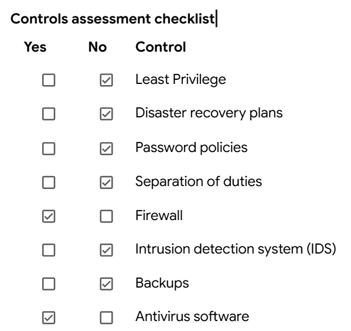

```markdown
# Internal Security Audit — Botium Toys

> Google Cybersecurity Professional Certificate — Portfolio Activity

## Overview

| Item | Details |
|---|---|
| **Scenario** | Internal security audit for Botium Toys, a fictional company |
| **Focus** | Security controls, risk, and compliance gaps |
| **Framework** | NIST Cybersecurity Framework |
| **Compliance Areas** | PCI DSS, GDPR, SOC |
| **Deliverable** | Controls and Compliance Checklist |

---

## Key Findings

| Implemented | Gaps Identified |
|---|---|
| Firewall | Least privilege |
| Antivirus | Separation of duties |
| Physical locks | Encryption |
| CCTV | IDS |
| Fire detection | Backups |
| Data integrity controls | Disaster recovery |
|  | Strong password controls |
|  | Proper asset classification |

---

## Recommendations

1. **Strengthen access control** — implement least privilege and separation of duties.
2. **Protect sensitive data** — use encryption and stronger password management.
3. **Improve resilience** — establish backups and a disaster recovery plan.
4. **Improve monitoring** — deploy an IDS and formalize legacy-system monitoring.
5. **Address compliance gaps** — secure payment data and properly classify assets.

---

## Deliverable

📄 [Completed Controls and Compliance Checklist](./controls-and-compliance-checklist.pdf)



---

## Skills Practiced

`Security Auditing` • `Risk Assessment` • `NIST CSF` • `PCI DSS` • `GDPR` • `Security Controls`

---

## Key Takeaway

A security control should not only exist — it should be implemented well enough to achieve its intended security objective.

---

> **Note:** This is a simulated course activity completed as part of the Google Cybersecurity Professional Certificate. Botium Toys is a fictional organization.
```
