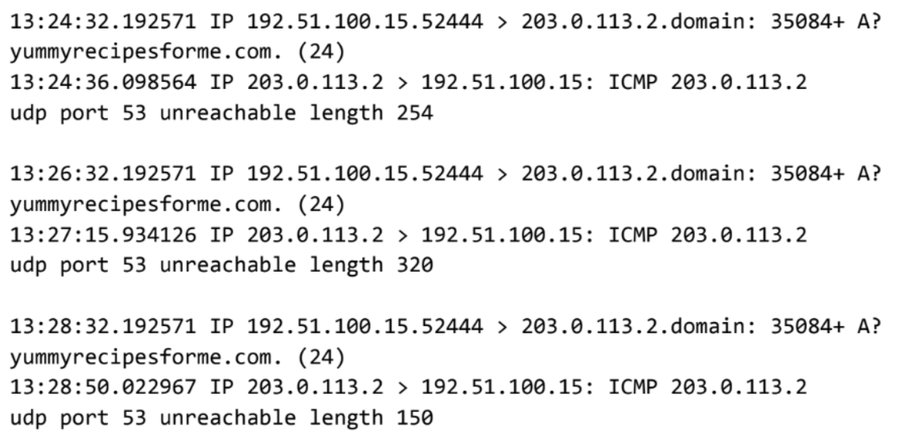

# DNS and ICMP Network Traffic Analysis

> Google Cybersecurity Professional Certificate — Portfolio Activity

## Overview

This activity involved analyzing simulated network traffic to investigate why users were unable to access a website.

Using a provided `tcpdump` log, I examined DNS, UDP, and ICMP traffic to identify the affected network service and document the findings in a cybersecurity incident report.

---

## Scenario

Customers reported that they could not access `yummyrecipesforme.com` and received a **“destination port unreachable”** error.

To investigate the issue, network traffic was captured using `tcpdump`. The browser attempted to resolve the website's domain name by sending a DNS request over UDP to port 53.

---

## tcpdump Evidence

The packet capture below shows the DNS request being sent over UDP and the corresponding ICMP error response.

> **Figure 1.** tcpdump log showing DNS traffic over UDP port 53 and the ICMP response `udp port 53 unreachable`.

The important indicators in the log were:

* DNS requests sent using **UDP**
* Destination service using **port 53**
* DNS **A record** query for the website
* ICMP response reporting `udp port 53 unreachable`

---

## Analysis

| Item              | Finding                   |
| ----------------- | ------------------------- |
| Tool              | tcpdump                   |
| Request Protocol  | UDP                       |
| Service           | DNS                       |
| Port              | 53                        |
| Response Protocol | ICMP                      |
| Error             | `udp port 53 unreachable` |
| Impact            | DNS resolution failed     |

The traffic indicated that the DNS service on UDP port 53 was unavailable or unreachable. Possible causes included a DNS service failure, firewall blocking, or server misconfiguration.

---

## Skills Demonstrated

* Network traffic analysis
* Reading `tcpdump` logs
* DNS and UDP analysis
* ICMP error interpretation
* Identifying ports and services
* Incident documentation
* Basic troubleshooting and root-cause analysis

---

## Key Takeaway

This activity reinforced how packet-level evidence can be used to trace a network problem from the user-facing symptom to the affected service.

`DNS query → UDP port 53 → ICMP port unreachable → DNS resolution failure`

---

## Artifact

The completed cybersecurity incident report contains the full traffic analysis, suspected cause, and recommended next troubleshooting steps.

> This activity was completed as part of the Google Cybersecurity Professional Certificate using a simulated incident scenario.
