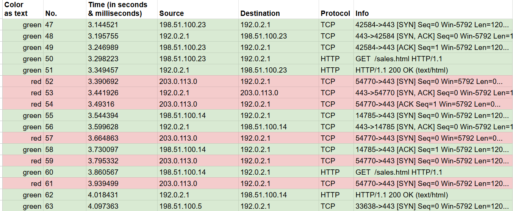
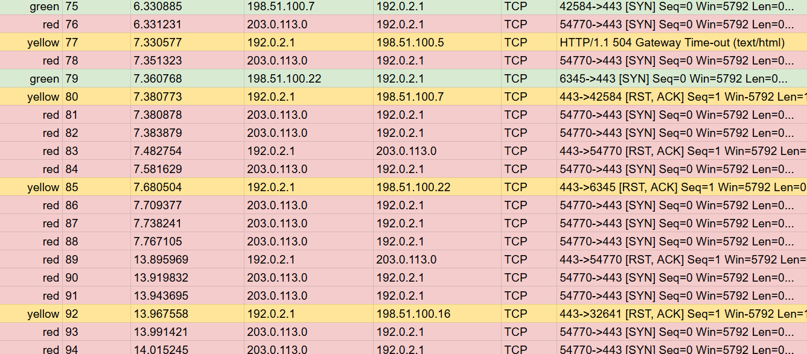

# SYN Flood DoS Analysis

> Google Cybersecurity Professional Certificate — Portfolio Activity

## Overview

This activity involved analyzing simulated network traffic to investigate why users were experiencing connection timeouts when accessing a website.

The traffic pattern indicated a possible **Denial-of-Service (DoS) attack**, specifically a **SYN flood**, where repeated TCP connection requests consumed server resources and affected legitimate users.

---

## Scenario

Users reported that the website was timing out and becoming unavailable.

The network traffic showed repeated **SYN requests** from the same source IP address. Many of these connection attempts did not successfully complete the TCP three-way handshake, which can cause the server to maintain multiple half-open connections.

---

## Network Traffic Evidence

The screenshot below shows the packet traffic used during the analysis.

> Network traffic showing repeated SYN connection requests and incomplete TCP handshakes.

Key indicators observed in the traffic:

* Repeated **SYN packets** from the same source
* TCP connections that were not consistently completed
* Increasing connection failures or timeouts
* Server resources becoming unavailable to legitimate users

---

## Analysis

| Item               | Finding                                          |
| ------------------ | ------------------------------------------------ |
| Attack Type        | Denial-of-Service (DoS)                          |
| Specific Technique | SYN Flood                                        |
| Protocol           | TCP                                              |
| Main Indicator     | Repeated incomplete connection attempts          |
| Impact             | Legitimate users unable to establish connections |

A normal TCP connection uses a three-way handshake:

`SYN → SYN-ACK → ACK`

During a SYN flood, the attacker sends a large number of SYN requests but does not complete the handshake. The server continues reserving resources for these half-open connections until its ability to process legitimate requests is reduced.

---

## Mitigation

Possible defenses include:

* **SYN cookies** to reduce resource usage from half-open connections
* **Rate limiting** to restrict excessive SYN requests
* Firewall or **IPS rules** to detect and block abnormal SYN traffic
* DDoS mitigation services for larger-scale attacks

---

## Skills Demonstrated

* Network traffic analysis
* TCP three-way handshake analysis
* Identification of SYN flood behavior
* DoS attack analysis
* Basic incident reporting
* Network security troubleshooting

---

## Key Takeaway

This activity demonstrated how abnormal TCP connection patterns can indicate a SYN flood and how repeated half-open connections can affect the **availability** of a web server.

`Repeated SYN requests → Half-open connections → Resource exhaustion → Connection timeouts`

---

## Artifact

The accompanying cybersecurity incident report documents the traffic analysis, suspected attack type, impact on the server, and recommended mitigation steps.

> This activity was completed as part of the Google Cybersecurity Professional Certificate using a simulated network incident.
