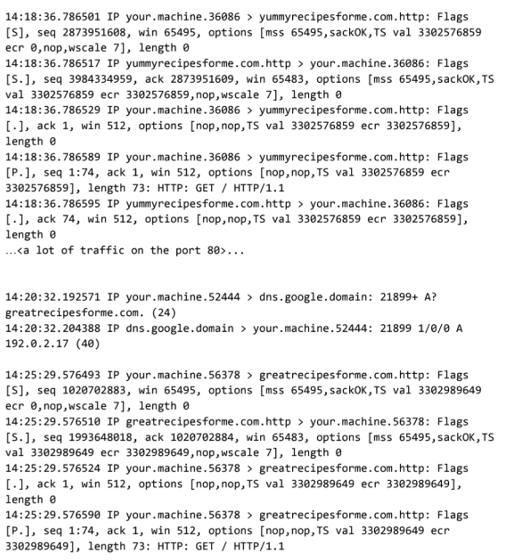

# Brute Force Web Compromise — Network Traffic Analysis

> Google Cybersecurity Professional Certificate —  Activity

## Overview

This activity involved analyzing a simulated website compromise caused by a **brute-force attack** against an administrative account.

The attacker gained access using a default password, modified the website source code, and added malicious JavaScript that prompted users to download an executable file. After execution, users were redirected from the legitimate website to a malicious domain.

---

## Scenario

Customers reported that `yummyrecipesforme.com` prompted them to download a file before accessing free recipes. After running the file, their browsers were redirected to `greatrecipesforme.com`, and their computers began running more slowly.

The website owner was also unable to access the administrative panel after the attacker changed the account password.

---

## Network Traffic Evidence

The traffic below was analyzed using `tcpdump`.

> **Figure 1.** Network traffic showing DNS resolution, TCP connection establishment, and HTTP requests to both the legitimate and malicious domains.

The capture highlights the sequence of network activity:

* DNS request for `yummyrecipesforme.com`
* DNS response containing the legitimate website IP address
* Successful TCP three-way handshake
* HTTP `GET` request to the legitimate website
* DNS request for `greatrecipesforme.com` after the malicious file was executed
* Successful connection and HTTP request to the malicious domain

The important finding is that **DNS and TCP were functioning normally**. The suspicious behavior was the browser making a new request to `greatrecipesforme.com` after the executable was run.

---

## Protocol Analysis

| Protocol | Role in the Incident                                        |
| -------- | ----------------------------------------------------------- |
| **DNS**  | Resolved domain names into IP addresses                     |
| **UDP**  | Transported the DNS queries                                 |
| **TCP**  | Established connections between the browser and web servers |
| **HTTP** | Requested and transferred webpage content                   |

---

## Incident Analysis

The attacker gained access to the website's administrative account by repeatedly attempting known default passwords.

After successfully authenticating, the attacker:

1. Accessed the administrative panel.
2. Modified the website source code.
3. Added malicious JavaScript.
4. Prompted visitors to download an executable file.
5. Redirected users to `greatrecipesforme.com` after the file was executed.
6. Changed the administrative password to prevent the legitimate owner from accessing the account.

The primary security weaknesses were the use of a **default administrative password** and the absence of controls to prevent repeated login attempts.

---

## Remediation

Recommended controls include:

* Replace all default credentials with strong, unique passwords
* Enforce a strict password policy for administrative accounts
* Enable multi-factor authentication
* Implement login rate limiting or account lockout
* Monitor repeated failed login attempts

---

## Skills Demonstrated

* Network traffic analysis
* Reading `tcpdump` logs
* DNS, UDP, TCP, and HTTP protocol identification
* Incident documentation
* Root-cause analysis
* Brute-force attack analysis
* Security remediation recommendations

---

## Key Takeaway

This activity demonstrated how a weak administrative credential can lead to a full website compromise and how network traffic can help trace the sequence of events.

`Brute-force login → Admin compromise → Malicious code injection → Malware download → Redirect to malicious domain`

---

## Artifact

The accompanying cybersecurity incident report contains the detailed protocol analysis, incident documentation, and recommended remediation.

> This activity was completed as part of the Google Cybersecurity Professional Certificate using a simulated cybersecurity incident.
