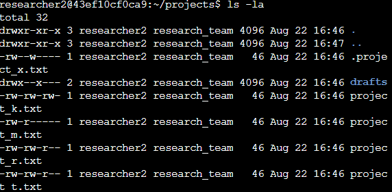
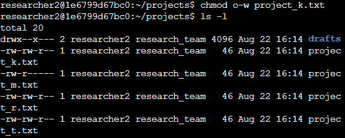
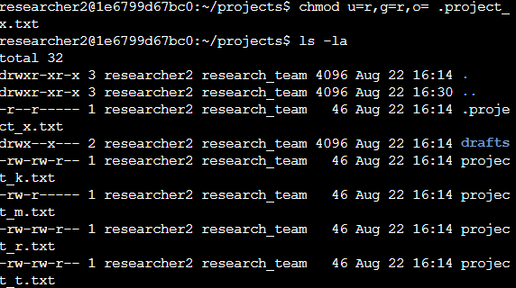
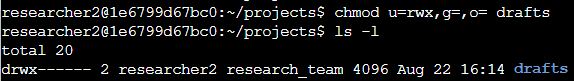

# Linux File Permissions and Authorization

> Google Cybersecurity Professional Certificate — Portfolio Activity

## Overview

This activity involved reviewing and modifying Linux file and directory permissions for a research team.

The objective was to identify excessive permissions, remove unauthorized access, and ensure that users only had the level of access required for their role. I used Linux commands including `ls`, `chmod`, and symbolic permission notation to apply appropriate authorization controls.

---

## Scenario

The files and directories belonged to the `researcher2` user and were used by a research team.

The organization required the following access controls:

- Other users must not have write access to project files.
- The archived hidden file `.project_x.txt` must be read-only for the owner and group.
- Only `researcher2` should be able to access the `drafts` directory.

---

## 1. Inspect File Permissions

I used:

```bash
ls -la
```

to display files, directories, hidden files, and their current permissions.



Linux permissions are represented using a 10-character string such as:

```text
-rw-rw-rw-
```

The permissions are divided into four sections:

```text
- | rw- | rw- | rw-
    user  group  others
```

- First character: file type
- `r`: read
- `w`: write
- `x`: execute
- `-`: permission not granted

---

## 2. Remove Unauthorized Write Access

The file `project_k.txt` allowed users classified as **others** to modify the file.

I removed this permission with:

```bash
chmod o-w project_k.txt
```



The command uses:

- `o` — others
- `-` — remove a permission
- `w` — write permission

This changed the permissions so users outside the owner and group could no longer modify the file.

---

## 3. Secure the Hidden Archived File

The hidden file `.project_x.txt` was archived and should not be modified by anyone.

The owner and group only needed permission to read it, while other users should have no access.

I applied:

```bash
chmod u=r,g=r,o= .project_x.txt
```



The resulting permissions were:

```text
-r--r-----
```

This means:

| User Type | Permissions |
| --------- | ----------- |
| Owner     | Read        |
| Group     | Read        |
| Others    | None        |

This follows the requirement that the archived file remain readable but cannot be modified.

---

## 4. Restrict Directory Access

Only the owner, `researcher2`, should be able to access the `drafts` directory.

I used:

```bash
chmod u=rwx,g=,o= drafts
```



The resulting permissions were:

```text
drwx------
```

This gives the owner:

- Read (`r`)
- Write (`w`)
- Execute (`x`)

while the group and others receive no permissions.

---

## Security Principle Applied

The permission changes follow the **principle of least privilege**, which means users should receive only the access necessary to perform their responsibilities.

Removing unnecessary permissions helps reduce the risk of unauthorized viewing, modification, or access to sensitive files.

---

## Skills Demonstrated

- Linux command-line navigation
- File and directory permission analysis
- `ls -la`
- `chmod`
- Symbolic permission notation
- Hidden file management
- Linux authorization
- Principle of least privilege

---

## Key Takeaway

This activity demonstrated how Linux permissions can be reviewed and modified to enforce appropriate authorization.

```text
Inspect permissions
        ↓
Identify excessive access
        ↓
Modify permissions with chmod
        ↓
Verify changes
        ↓
Apply least privilege
```

---

## Artifact

The accompanying file permissions report documents the permission review, command usage, authorization changes, and final results.

> This activity was completed as part of the Google Cybersecurity Professional Certificate using a simulated Linux environment.
