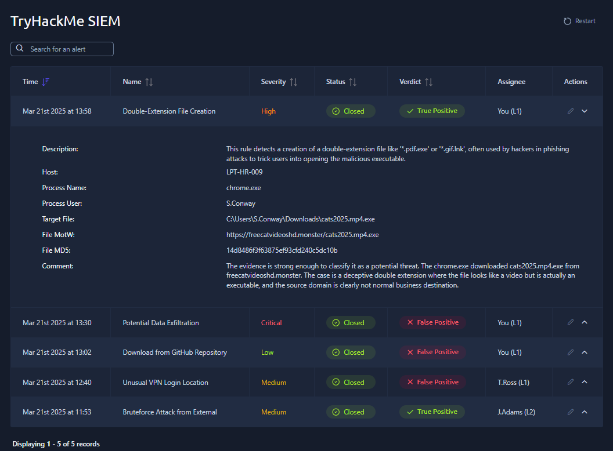
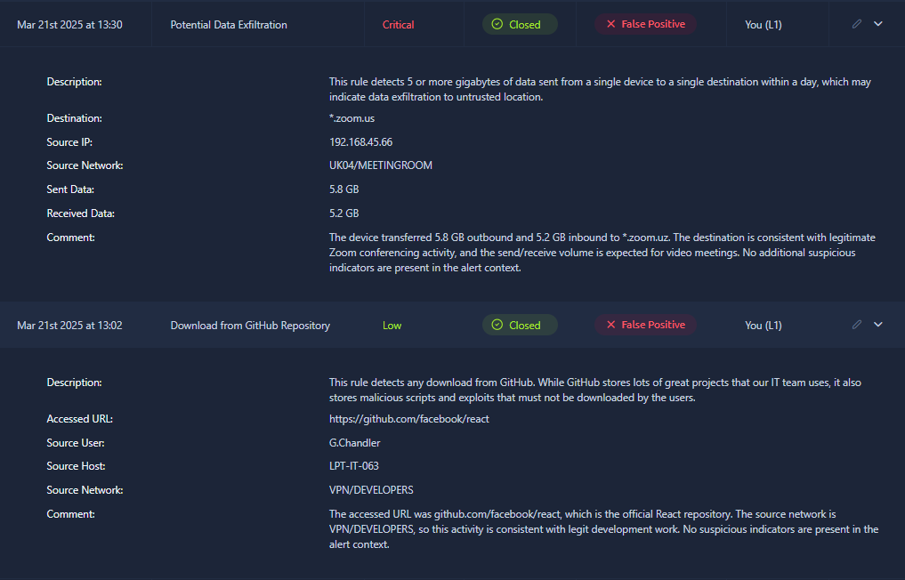

# SOC Alert Triage — TryHackMe

## Overview

This lab involved triaging multiple security alerts in a simulated SOC environment using the TryHackMe SIEM.

The goal was to review each alert, understand the surrounding context, determine whether the activity was legitimate or suspicious, and document the reasoning behind each decision.

---

## What I Did

* Assigned alerts for investigation
* Reviewed alert details and affected assets
* Analyzed user, host, network, destination, and file context
* Distinguished between expected and suspicious activity
* Classified alerts as True Positive or False Positive
* Added analyst comments explaining each verdict
* Closed alerts after completing the investigation

---

## Alerts Reviewed

The lab included alerts related to:

* Potential data exfiltration
* Downloads from GitHub repositories
* Suspicious double-extension file creation

The exercise demonstrated that alert severity alone does not determine whether an event is malicious. Context such as the user's role, destination, network location, file behavior, and expected business activity is important when making a decision.

---

## Key Takeaways

* A high-severity alert can still represent legitimate activity.
* Security alerts should be validated before being treated as incidents.
* User and device context can significantly affect an analyst's verdict.
* Suspicious file names, extensions, and source domains can provide important indicators.
* Analyst comments should clearly explain the evidence behind a decision.

---

## Skills Practiced

`SOC Alert Triage` `SIEM` `Event Analysis` `True/False Positive Classification` `Incident Documentation`

---

## Artifacts

### Completed Alert Triage

### Alert Investigation Details

---

## Platform

**TryHackMe — SOC Level 1**

> This lab was completed in a guided TryHackMe environment as part of my hands-on cybersecurity learning.
